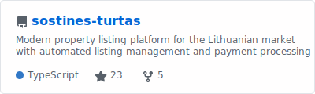

**Software Engineer | Aspiring AI/ML Specialist | Autonomous Systems Builder**

I build production AI systems that think for themselves. Currently crafting autonomous agents and multi-agent platforms that solve complex problems without human intervention.

## 👷 What I'm Working On

<table style="border-collapse: collapse; border: none;">
<tr style="border: none;">
<td width="50%" valign="top" style="border: none;">

## 🚀 Recent Highlights

**🤖 AI Security Testing Platform @ Capital One**
Built enterprise platform with 14+ autonomous agents using LangChain/LangGraph. Achieves 95% detection coverage across OWASP Top 10 with <5% false positives, completing full security assessments in under 4 hours.

**🏠 Sostines Turtas**
Co-founded property listing platform disrupting the Lithuanian market. Full-stack solution with automated listing management, search, and payment processing.

</td>
<td width="50%" valign="top" style="border: none;">

## 📊 GitHub Stats

</td>
</tr>
</table>

## 📜 Certifications

  
  
  
  

## 🎓 Education

**BSc Artificial Intelligence and Computer Science** – First Class Honours in Computer Science
University of Sheffield | Focused on ML, Neural Networks, and Safety-Critical Systems
